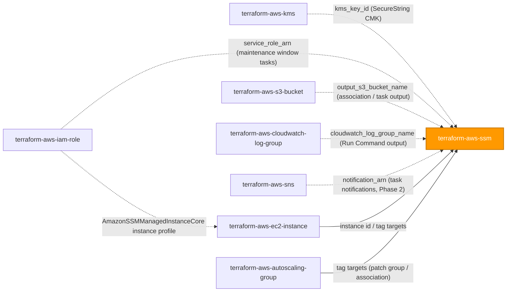
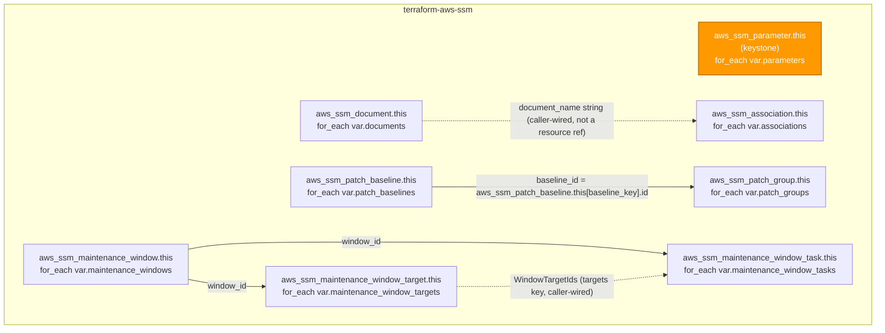

# 🟧 AWS **Systems Manager (SSM)** Terraform Module

> **Secure-by-default Systems Manager control plane** — Parameter Store, Documents, State Manager Associations, Patch Manager (baseline + patch group), and a fully wired Maintenance Window (target + task), plus our recommended Session Manager wiring pattern for SSH-free EC2 access. Built for the AWS provider **v6.x**.


---

## 🧩 Overview

- 🔐 **`aws_ssm_parameter.this`** keystone — Parameter Store entries default to **`SecureString`**; caller opts a specific entry into `String`/`StringList` only for non-secret values (feature flags, config).
- 📄 **`aws_ssm_document.this`** — Command / Automation / Session / Policy documents, private by default; public (`"All"`) sharing is **hard-blocked**, not just discouraged.
- 🗓️ **`aws_ssm_association.this`** — State Manager bindings of a document to targets on a cron/rate schedule, with optional S3 output logging.
- 🩹 **`aws_ssm_patch_baseline.this` + `aws_ssm_patch_group.this`** — Patch Manager baseline and its patch-group registration; `operating_system` is **required with no default**, closing the provider's WINDOWS-default foot-gun for Linux fleets.
- 🪟 **`aws_ssm_maintenance_window.this` + `aws_ssm_maintenance_window_target.this` + `aws_ssm_maintenance_window_task.this`** — a maintenance window that actually runs something, not an inert shell.
- 🏷️ **Universal tagging** on every taggable SSM resource type; `aws_ssm_patch_group`, `aws_ssm_maintenance_window_target`, and `aws_ssm_maintenance_window_task` are not taggable in the current provider schema and are explicitly documented as such.
- 🧱 All 8 resources are **`for_each`**-driven over `map(object(...))` — no `count` anywhere in this module.
- 🖥️ our standard vehicle for wiring **Session Manager** as the default, SSH-free path to EC2 access — this module targets instances by association/patch-group/maintenance-window; the instance-profile role itself is owned by `terraform-aws-iam-role`.

> 💡 **Why it matters:** Parameter Store, State Manager, Patch Manager, and Maintenance Windows are the operational backbone of a fleet can patch, configure, and remotely administer without SSH keys, bastions, or open port 22 — a material reduction in attack surface for PII-adjacent workloads under regulated-industry oversight.

---

## ❤️ Support this project

If these Terraform modules have been helpful to you or your organization, I'd appreciate your support in any of the following ways:

- ⭐ **Star this repository** to help others discover this Terraform module.
- 🤝 **Connect with me on LinkedIn:** [linkedin.com/in/microsoftexpert](https://www.linkedin.com/in/microsoftexpert)
- ☕ **Buy me a coffee:** [buymeacoffee.com/microsoftexpert](https://buymeacoffee.com/microsoftexpert)

Whether it's a star, a professional connection, or a coffee, every gesture helps keep these modules actively maintained and continually improving. Thank you for being part of the community!

---

## 🗺️ Where this fits in the family

`terraform-aws-ssm` sits downstream of the identity and encryption foundations and operates *on* compute fleets provisioned elsewhere — it never creates an instance, a role, or a key itself.



> ℹ️ `terraform-aws-ssm` never creates the EC2 instance, the instance profile, the CMK, or the log destination — it consumes each by reference (ARN, id, or name) and documents the wiring. See **Cross-Module Contract** below.

---

## 🧬 What this module builds



| Resource | Role | Cardinality | Tags? | ARN? |
|---|---|---|---|---|
| `aws_ssm_parameter.this` | Keystone — Parameter Store value | per `parameters` entry | ✅ | ✅ |
| `aws_ssm_document.this` | Command/Automation/Session/Policy document | per `documents` entry | ✅ | ✅ |
| `aws_ssm_association.this` | State Manager schedule binding a document to targets | per `associations` entry | ✅ | ✅ |
| `aws_ssm_patch_baseline.this` | Patch Manager approval rules/filters | per `patch_baselines` entry | ✅ | ✅ |
| `aws_ssm_patch_group.this` | Registers a patch group name against a baseline | per `patch_groups` entry | ❌ | ❌ |
| `aws_ssm_maintenance_window.this` | Scheduled window (cutoff/duration container) | per `maintenance_windows` entry | ✅ | ❌ |
| `aws_ssm_maintenance_window_target.this` | Target registration for a window | per `maintenance_window_targets` entry | ❌ | ❌ |
| `aws_ssm_maintenance_window_task.this` | Task registration for a window | per `maintenance_window_tasks` entry | ❌ | ✅ |

---

## ✅ Provider / Versions

| Requirement | Version |
|---|---|
| Terraform | `>= 1.12.0` |
| `hashicorp/aws` | `>= 6.0, < 7.0` |

No `provider {}` block is declared inside the module — the caller's configured provider (region/credentials) is inherited. No `region` variable — SSM is a regional service with no `us-east-1` global-resource coupling.

---

## 🔑 Required IAM Permissions

Least-privilege actions the **Terraform identity** needs to create, read, update, and delete everything this module manages:

| Action | Required for | Notes |
|---|---|---|
| `ssm:PutParameter`, `ssm:DeleteParameter`, `ssm:GetParameter`, `ssm:GetParameters`, `ssm:DescribeParameters` | Parameter Store lifecycle | — |
| `kms:Decrypt`, `kms:GenerateDataKey`, `kms:DescribeKey` | Reading/writing `SecureString` values under a CMK | Grant lives on the **KMS key policy** (`terraform-aws-kms`), not this module |
| `ssm:CreateDocument`, `ssm:DeleteDocument`, `ssm:DescribeDocument`, `ssm:UpdateDocument`, `ssm:UpdateDocumentDefaultVersion`, `ssm:ModifyDocumentPermission` | Document lifecycle, versioning, sharing | `ModifyDocumentPermission` only when `permissions` is set |
| `ssm:CreateAssociation`, `ssm:DeleteAssociation`, `ssm:DescribeAssociation`, `ssm:UpdateAssociation` | State Manager association lifecycle | — |
| `ssm:CreatePatchBaseline`, `ssm:DeletePatchBaseline`, `ssm:GetPatchBaseline`, `ssm:UpdatePatchBaseline` | Patch baseline lifecycle | — |
| `ssm:RegisterPatchBaselineForPatchGroup`, `ssm:DeregisterPatchBaselineForPatchGroup`, `ssm:GetPatchBaselineForPatchGroup` | Patch group registration | — |
| `ssm:CreateMaintenanceWindow`, `ssm:DeleteMaintenanceWindow`, `ssm:GetMaintenanceWindow`, `ssm:UpdateMaintenanceWindow` | Maintenance window lifecycle | — |
| `ssm:RegisterTargetWithMaintenanceWindow`, `ssm:DeregisterTargetFromMaintenanceWindow`, `ssm:GetMaintenanceWindowTarget` | Maintenance window target registration | — |
| `ssm:RegisterTaskWithMaintenanceWindow`, `ssm:DeregisterTaskFromMaintenanceWindow`, `ssm:GetMaintenanceWindowTask`, `ssm:UpdateMaintenanceWindowTask` | Maintenance window task registration | — |
| `ssm:AddTagsToResource`, `ssm:RemoveTagsFromResource`, `ssm:ListTagsForResource` | Tagging across Parameter / Document / PatchBaseline / MaintenanceWindow / Association | Skipped for `aws_ssm_patch_group`, `_maintenance_window_target`, `_maintenance_window_task` — not taggable |
| `iam:PassRole` | Passing `service_role_arn` to a maintenance window task | **Scope to the specific role ARN — never `*`** |
| `iam:CreateServiceLinkedRole` | Only if the account has never used Patch Manager / maintenance window tasks before and no `service_role_arn` is supplied | AWS auto-creates `AWSServiceRoleForAmazonSSM` on first use — a one-time, account-level, audit-relevant side effect |

> ℹ️ This is the permission set for the **identity running `terraform apply`**. It is entirely separate from the permissions an **EC2 instance's own role** needs to be managed by SSM (`AmazonSSMManagedInstanceCore`) — see the dedicated Session Manager note below.

---

## 📋 AWS Prerequisites

- **No service-linked role required** to create `aws_ssm_parameter` or `aws_ssm_document`. Maintenance window tasks that omit `service_role_arn` cause AWS to auto-create `AWSServiceRoleForAmazonSSM` on first use — a one-time, account-level, implicit side effect worth flagging in change review.
- **Session Manager / managed-node prerequisites** (the actual gate on whether an association, patch baseline, or maintenance window can reach an instance at all):
 - **SSM Agent** running on the target — preinstalled on AWS-published Amazon Linux 2/2023, Ubuntu, and Windows AMIs; installed manually on custom/older AMIs.
 - **Network reachability** to the `ssm`, `ssmmessages`, and `ec2messages` endpoints — public egress (NAT/IGW), or VPC interface endpoints (`com.amazonaws.<region>.ssm`, `.ssmmessages`, `.ec2messages` via `terraform-aws-vpc-endpoint`) for fully private subnets.
 - **IAM permission for the instance to call SSM**, via one of two paths (see AWS's own guidance in *Verify or add instance permissions for Session Manager*):
 1. **Default Host Management Configuration** — an account/Region-level setting using the AWS-managed `AmazonSSMManagedEC2InstanceDefaultPolicy` via a default IAM role (`AWSSystemsManagerDefaultEC2InstanceManagementRole`). No per-instance profile needed once activated for the account/Region. Requires **IMDSv2** and **SSM Agent >= 3.2.582.0** on every managed instance, and `iam:PassRole` on the default role for whoever activates it.
 2. **Instance profile** carrying **`AmazonSSMManagedInstanceCore`** (or a narrower custom policy covering the same core actions) attached to the EC2 instance — the traditional, per-instance-role path. **This is the path our examples wire explicitly** (see the dedicated note below).
 - **Hybrid/on-premises nodes** use a hybrid activation's IAM service role instead of an instance profile; they do not use Default Host Management Configuration.
- **Patch Manager quotas/behavior:** a patch baseline supports up to **10** `approval_rule` blocks and **4** `global_filter` blocks; each `approval_rule` supports up to **5** `patch_filter` blocks (all enforced by this module's `variables.tf` validation blocks); at least one of `approved_patches` or `approval_rule` must be set (both together or both absent are rejected by the API, also enforced by validation). `operating_system` defaults to `WINDOWS` in the raw provider schema — this module requires it explicitly with no default.
- **Maintenance window quotas:** AWS enforces a maximum of **5 concurrently running maintenance windows** account-wide (soft, raiseable) and a bounded number of registered targets/tasks per window; `cutoff` must be less than `duration` (enforced by validation).
- **Parameter Store tiers/quotas:** `Standard` tier is free and limited to 4 KB; `Advanced` raises the value size to 8 KB, adds a per-parameter monthly charge, and enables parameter policies (not modeled in this module's v1); `Intelligent-Tiering` auto-selects between them. Total parameter count is a soft, raiseable account quota. **Downgrading `tier` from `Advanced` to `Standard` is force-new.**
- **`SecureString` only supports symmetric KMS keys** — an asymmetric CMK supplied via `kms_key_id` will fail at apply time, not plan time.
- **Region:** standard provider inheritance — no `region` variable in this module; SSM is not a `us-east-1` global-resource service.

### 🖥️ Session Manager IAM policy — dedicated note for `terraform-aws-ec2-instance`

standardizes on **AWS Systems Manager Session Manager** as the default method for interactive EC2 access, in preference to SSH with distributed key pairs and an open port 22 — this eliminates inbound security-group rules, long-lived SSH keys, and bastion hosts entirely, materially reducing the attack surface for PII-adjacent workloads. This module does **not** create the instance profile itself; every EC2-facing example below wires the following pattern so the recommendation is visible at the point of use:

1. `terraform-aws-iam-role` creates an EC2-trusted role with the AWS-managed policy **`AmazonSSMManagedInstanceCore`** attached — covers `ssmmessages:*`, `ec2messages:*`, and the minimum `ssm:UpdateInstanceInformation` / `ssm:ListAssociations` / `ssm:GetDocument`-class actions the agent needs to register and poll for work — plus, if instance-level Parameter Store or KMS access is required, a scoped inline policy. **Never attach the broader `AmazonSSMFullAccess`.**
2. `terraform-aws-iam-role` wraps the role in an `aws_iam_instance_profile`.
3. `terraform-aws-ec2-instance` consumes the instance profile **name** via its `iam_instance_profile` argument.
4. `terraform-aws-ssm` (this module) then targets that instance — by instance ID or tag — with `aws_ssm_association`, a patch group, or a maintenance window target.

Callers on newer accounts may instead enable **Default Host Management Configuration** at the account level (no per-instance profile needed — see AWS Prerequisites above), but the per-instance-profile pattern remains the explicit, auditable default this library recommends for regulated workloads: it keeps the permission grant scoped and visible in the Terraform plan for the specific instance/role, rather than an implicit account-wide default that changes what *every* instance in the Region can do.

---

## 📁 Module Structure

```
terraform-aws-ssm/
├── providers.tf # terraform{} + required_providers (aws >= 6.0, < 7.0); no provider block
├── variables.tf # parameters (keystone), documents, associations, patch_baselines/groups,
│ # maintenance_windows/targets/tasks, kms_key_id, tags
├── main.tf # all 8 for_each resources; no count anywhere
├── outputs.tf # id + arn maps per resource family, tags_all per taggable resource
├── README.md # this file
└── SCOPE.md # in/out-of-scope, IAM, prerequisites, emits, gotchas
```

---

## ⚙️ Quick Start

```hcl
module "ssm" {
  source = "git::https://github.com/microsoftexpert/terraform-aws-ssm?ref=v1.0.0"

  parameters = {
    "/app/prod/db/password" = {
      value  = var.db_password # SecureString by default
      key_id = module.kms.arn  # terraform-aws-kms — customer-managed CMK
    }
  }

  tags = {
    Environment = "prod"
    CostCenter  = "infra"
  }
}
```

> ⚠️ Pin the source with `?ref=v1.0.0`, never a branch. Wire `kms_key_id` from `terraform-aws-kms` for a customer-managed CMK, and see the Example Library for the Session Manager instance-profile pattern, patch baseline/group wiring, and a fully-registered maintenance window.

---

## 🔌 Cross-Module Contract

### Consumes

| Input | Type | Source module |
|---|---|---|
| `kms_key_id` | `string` (KMS key ID or ARN, optional) | `terraform-aws-kms` |
| `parameters[*].key_id` | `string` (per-entry override, optional) | `terraform-aws-kms` |
| `maintenance_window_tasks[*].service_role_arn` | `string` (IAM role ARN, optional) | `terraform-aws-iam-role` |
| `associations[*].output_location.s3_bucket_name` | `string` (optional) | `terraform-aws-s3-bucket` |
| `maintenance_window_tasks[*].task_invocation_parameters.run_command_parameters.cloudwatch_config.cloudwatch_log_group_name` | `string` (optional) | `terraform-aws-cloudwatch-log-group` |
| — (documented, not a module variable) `iam_instance_profile` | ARN/name | `terraform-aws-iam-role` → `terraform-aws-ec2-instance` |
| — (documented, not a module variable) target instances/ASGs | instance ID / tag key-value | `terraform-aws-ec2-instance` / `terraform-aws-autoscaling-group` |

### Emits

| Output | Description | Consumed by |
|---|---|---|
| `id` | Map of parameter name → parameter `id` | App config lookups, `terraform-aws-ecs-service`, `terraform-aws-lambda` |
| `arn` | Map of parameter name → parameter ARN | `terraform-aws-iam-policy` (scoping `ssm:GetParameter`), `terraform-aws-ecs-service` (`valueFrom`) |
| `name` | Map of parameter name → parameter name | Documentation / cross-references |
| `version` | Map of parameter name → current version | Drift detection |
| `tags_all` | Map of parameter name → merged tags | Governance / audit |
| `document_ids` / `document_arns` / `document_names` / `document_tags_all` | Document identity + tags | `aws_ssm_association.name` references, `terraform-aws-ec2-instance` user-data bootstrapping |
| `association_ids` / `association_arns` / `association_tags_all` | Association identity + tags | Audit / drift-detection references |
| `patch_baseline_ids` / `patch_baseline_arns` / `patch_baseline_tags_all` | Baseline identity + tags | `aws_ssm_patch_group` registration, Patch Manager console cross-reference |
| `patch_group_ids` | Composite id (`"<patch_group>,<baseline_id>"`) | Audit — not taggable, no ARN |
| `maintenance_window_ids` / `maintenance_window_tags_all` | Window identity + tags | `_target` / `_task`, `terraform-aws-cloudwatch-alarm` (window compliance) — no ARN attribute exposed |
| `maintenance_window_target_ids` | Target id | Audit — not taggable, no ARN |
| `maintenance_window_task_ids` / `maintenance_window_task_arns` | Task identity | Audit — not taggable despite exposing an ARN |

---

## 📚 Example Library

<details>
<summary><b>1 · Minimal — SecureString parameter with a customer-managed KMS key</b></summary>

```hcl
module "kms" {
  source = "git::https://github.com/microsoftexpert/terraform-aws-kms?ref=v1.0.0"
  name   = "casey-ssm-params"
}

module "ssm" {
  source = "git::https://github.com/microsoftexpert/terraform-aws-ssm?ref=v1.0.0"

  parameters = {
    "/app/prod/db/password" = {
      value  = var.db_password # SecureString — the default type
      key_id = module.kms.arn  # customer-managed CMK; null would use alias/aws/ssm
    }
  }
}
```
</details>

<details>
<summary><b>2 · Multiple parameters via <code>for_each</code> map</b></summary>

```hcl
module "ssm" {
  source = "git::https://github.com/microsoftexpert/terraform-aws-ssm?ref=v1.0.0"

  parameters = {
    "/app/prod/db/password"    = { value = var.db_password }
    "/app/prod/api/key"        = { value = var.api_key }
    "/app/prod/feature/flag_x" = { value = "true", type = "String" } # non-secret opt-out
    "/app/prod/db/connections" = { value = "50", type = "String", data_type = "text" }
  }

  kms_key_id = module.kms.arn # applies to every SecureString entry that omits its own key_id
}
```
</details>

<details>
<summary><b>3 · Document + State Manager association (config management)</b></summary>

```hcl
module "ssm" {
  source = "git::https://github.com/microsoftexpert/terraform-aws-ssm?ref=v1.0.0"

  documents = {
    install-agent = {
      document_type = "Command"
      content       = file("${path.module}/documents/install-agent.json")
    }
  }

  associations = {
    install-agent-fleet = {
      document_name       = module.ssm.document_names["install-agent"]
      schedule_expression = "cron(0 3 ? * * *)" # nightly at 03:00 UTC
      compliance_severity = "HIGH"
      targets             = [{ key = "tag:Role", values = ["app-server"] }]
    }
  }
}
```

> ℹ️ `document_name` on the association is a plain string, not a Terraform resource reference — wire it from `module.ssm.document_names["<key>"]` (this module's own output) or an AWS-owned document name like `AWS-RunPatchBaseline`.
</details>

<details>
<summary><b>4 · Patch baseline + patch group (Linux, <code>operating_system</code> required)</b></summary>

```hcl
module "ssm" {
  source = "git::https://github.com/microsoftexpert/terraform-aws-ssm?ref=v1.0.0"

  patch_baselines = {
    linux-prod = {
      operating_system = "AMAZON_LINUX_2023" # REQUIRED — no default (safety rail)
      approval_rule = [{
        approve_after_days = 7
        compliance_level   = "CRITICAL"
        patch_filter       = [{ key = "CLASSIFICATION", values = ["Security", "Bugfix"] }]
      }]
    }
  }

  patch_groups = {
    prod-linux = {
      baseline_key = "linux-prod" # must reference a key in patch_baselines — enforced by validation
      patch_group  = "prod-linux" # matches the "Patch Group" tag on target instances
    }
  }
}
```
</details>

<details>
<summary><b>5 · Maintenance window that actually runs something (target + task)</b></summary>

```hcl
module "ssm" {
  source = "git::https://github.com/microsoftexpert/terraform-aws-ssm?ref=v1.0.0"

  maintenance_windows = {
    weekly-patch = {
      schedule = "cron(0 16 ? * TUE *)"
      duration = 3
      cutoff   = 1
    }
  }

  maintenance_window_targets = {
    prod-fleet = {
      window_key    = "weekly-patch" # must reference a key in maintenance_windows
      resource_type = "INSTANCE"
      targets       = [{ key = "tag:PatchGroup", values = ["prod-linux"] }]
    }
  }

  maintenance_window_tasks = {
    run-patch-baseline = {
      window_key = "weekly-patch"
      task_type  = "RUN_COMMAND"
      task_arn   = "AWS-RunPatchBaseline" # AWS-owned document
      priority   = 1
      targets    = [{ key = "WindowTargetIds", values = [module.ssm.maintenance_window_target_ids["prod-fleet"]] }]

      task_invocation_parameters = {
        run_command_parameters = {
          timeout_seconds = 3600
        }
      }
    }
  }
}
```

> ⚠️ A window with no registered target/task performs no work — this module includes both as in-scope children specifically so a single call yields a functional patching window, not an inert shell.
</details>

<details>
<summary><b>6 · Session Manager instance-profile wiring for <code>terraform-aws-ec2-instance</code></b></summary>

```hcl
module "ssm_role" {
  source = "git::https://github.com/microsoftexpert/terraform-aws-iam-role?ref=v1.0.0"

  name = "app-server-ssm"
  assume_role_policy = jsonencode({
    Version = "2012-10-17"
    Statement = [{
      Effect    = "Allow"
      Principal = { Service = "ec2.amazonaws.com" }
      Action    = "sts:AssumeRole"
    }]
  })
  managed_policy_arns = ["arn:aws:iam::aws:policy/AmazonSSMManagedInstanceCore"] # never AmazonSSMFullAccess
  instance_profile    = {}                                                       # wraps the role in an aws_iam_instance_profile
}

module "app_server" {
  source = "git::https://github.com/microsoftexpert/terraform-aws-ec2-instance?ref=v1.0.0"

  name                 = "app-server"
  iam_instance_profile = module.ssm_role.instance_profile_name
  # no SSH key pair, no inbound port 22 — Session Manager is the only access path
}

module "ssm" {
  source = "git::https://github.com/microsoftexpert/terraform-aws-ssm?ref=v1.0.0"

  associations = {
    baseline-scan = {
      document_name = "AWS-RunPatchBaseline"
      targets       = [{ key = "InstanceIds", values = [module.app_server.id] }]
    }
  }
}
```
</details>

<details>
<summary><b>7 · Tags — merge with provider <code>default_tags</code></b></summary>

```hcl
# Caller's provider block owns default_tags; resource tags win on key conflict.
provider "aws" {
  region = "us-east-1"
  default_tags {
    tags = { Owner = "platform", ManagedBy = "terraform" }
  }
}

module "ssm" {
  source = "git::https://github.com/microsoftexpert/terraform-aws-ssm?ref=v1.0.0"

  parameters = {
    "/app/prod/db/password" = {
      value = var.db_password
      tags  = { Sensitivity = "high" } # merged on top of module tags for this entry only
    }
  }

  tags = {
    Environment = "prod"
    Owner       = "database-team" # overrides default_tags Owner on every taggable resource here
  }
}
# module.ssm.tags_all["/app/prod/db/password"] => { Owner="database-team", ManagedBy="terraform", Environment="prod", Sensitivity="high" }
```
</details>

<details>
<summary><b>8 · Secure-by-default opt-out — plaintext <code>String</code> for a non-secret feature flag</b></summary>

```hcl
module "ssm" {
  source = "git::https://github.com/microsoftexpert/terraform-aws-ssm?ref=v1.0.0"

  parameters = {
    # SecureString remains the default for every OTHER entry in this map.
    "/app/prod/feature/new_checkout_flow" = {
      value = "true"
      type  = "String" # explicit, per-parameter, visible opt-out — NON-SECRET VALUES ONLY
    }
    "/app/prod/db/password" = {
      value = var.db_password # still SecureString — the opt-out is per-entry, not module-wide
    }
  }
}
```

> ⚠️ `type = "String"`/`"StringList"` is a deliberate, per-parameter exception for non-secret configuration — never use it for credentials, tokens, or connection strings. `aws_ssm_parameter.value` is masked in plan output regardless of `type`, but the unencrypted value is still stored in plaintext in Terraform state for non-`SecureString` types.
</details>

<details>
<summary><b>9 · <code>for_each</code> pattern — one module call, N parameters from a map variable</b></summary>

```hcl
variable "app_secrets" {
  type = map(string)
}

module "ssm" {
  source = "git::https://github.com/microsoftexpert/terraform-aws-ssm?ref=v1.0.0"

  parameters = {
    for name, value in var.app_secrets :
    "/app/prod/${name}" => { value = value }
  }

  kms_key_id = module.kms.arn
}
```
</details>

<details>
<summary><b>10 · Document sharing with specific AWS accounts (never public)</b></summary>

```hcl
module "ssm" {
  source = "git::https://github.com/microsoftexpert/terraform-aws-ssm?ref=v1.0.0"

  documents = {
    shared-runbook = {
      document_type   = "Automation"
      content         = file("${path.module}/documents/shared-runbook.yaml")
      document_format = "YAML"
      permissions = {
        account_ids = ["222233334444", "555566667777"] # specific accounts only; "All" is rejected by validation
      }
    }
  }
}
```
</details>

<details>
<summary><b>11 · Automation document + association with rate control</b></summary>

```hcl
module "ssm" {
  source = "git::https://github.com/microsoftexpert/terraform-aws-ssm?ref=v1.0.0"

  documents = {
    restart-service = {
      document_type   = "Automation"
      content         = file("${path.module}/documents/restart-service.yaml")
      document_format = "YAML"
    }
  }

  associations = {
    restart-service-rollout = {
      document_name                    = module.ssm.document_names["restart-service"]
      automation_target_parameter_name = "InstanceId"
      max_concurrency                  = "10%"
      max_errors                       = "1"
      targets                          = [{ key = "tag:Role", values = ["worker"] }]
    }
  }
}
```
</details>

<details>
<summary><b>12 · Association with S3 command-output logging</b></summary>

```hcl
module "output_bucket" {
  source = "git::https://github.com/microsoftexpert/terraform-aws-s3-bucket?ref=v1.0.0"
  name   = "casey-ssm-command-output"
}

module "ssm" {
  source = "git::https://github.com/microsoftexpert/terraform-aws-ssm?ref=v1.0.0"

  associations = {
    baseline-scan = {
      document_name = "AWS-RunPatchBaseline"
      targets       = [{ key = "tag:PatchGroup", values = ["prod-linux"] }]
      output_location = {
        s3_bucket_name = module.output_bucket.id
        s3_key_prefix  = "ssm/patch-baseline"
      }
    }
  }
}
```
</details>

<details>
<summary><b>13 · Import an existing Parameter Store value</b></summary>

```hcl
import {
  to = module.ssm.aws_ssm_parameter.this["/app/prod/db/password"]
  id = "/app/prod/db/password"
}
```

> ℹ️ Import by parameter **name** (the `id` for this resource type), not ARN. Run `terraform plan` immediately after to confirm the imported `type`/`tier`/`key_id` match `var.parameters` before applying — a mismatch on `tier` will show a force-new diff.
</details>

<details>
<summary><b>14 · Maintenance window with SNS notifications and CloudWatch output</b></summary>

```hcl
module "task_notifications" {
  source = "git::https://github.com/microsoftexpert/terraform-aws-sns?ref=v1.0.0"
  name   = "ssm-maintenance-window-alerts"
}

module "command_logs" {
  source = "git::https://github.com/microsoftexpert/terraform-aws-cloudwatch-log-group?ref=v1.0.0"
  name   = "/casey/ssm/run-command"
}

module "ssm" {
  source = "git::https://github.com/microsoftexpert/terraform-aws-ssm?ref=v1.0.0"

  maintenance_windows = {
    weekly-patch = { schedule = "cron(0 16 ? * TUE *)", duration = 3, cutoff = 1 }
  }

  maintenance_window_targets = {
    prod-fleet = {
      window_key    = "weekly-patch"
      resource_type = "INSTANCE"
      targets       = [{ key = "tag:PatchGroup", values = ["prod-linux"] }]
    }
  }

  maintenance_window_tasks = {
    run-patch-baseline = {
      window_key = "weekly-patch"
      task_type  = "RUN_COMMAND"
      task_arn   = "AWS-RunPatchBaseline"
      targets    = [{ key = "WindowTargetIds", values = [module.ssm.maintenance_window_target_ids["prod-fleet"]] }]

      task_invocation_parameters = {
        run_command_parameters = {
          notification_config = {
            notification_arn    = module.task_notifications.arn
            notification_events = ["Failed", "TimedOut"]
            notification_type   = "Command"
          }
          cloudwatch_config = {
            cloudwatch_log_group_name = module.command_logs.name
            cloudwatch_output_enabled = true
          }
        }
      }
    }
  }
}
```
</details>

<details>
<summary><b>15 · End-to-end composition — KMS + IAM role + EC2 instance + SSM (finale)</b></summary>

```hcl
module "kms" {
  source = "git::https://github.com/microsoftexpert/terraform-aws-kms?ref=v1.0.0"
  name   = "casey-app"
}

module "ssm_role" {
  source = "git::https://github.com/microsoftexpert/terraform-aws-iam-role?ref=v1.0.0"

  name = "app-server-ssm"
  assume_role_policy = jsonencode({
    Version = "2012-10-17"
    Statement = [{
      Effect    = "Allow"
      Principal = { Service = "ec2.amazonaws.com" }
      Action    = "sts:AssumeRole"
    }]
  })
  managed_policy_arns = ["arn:aws:iam::aws:policy/AmazonSSMManagedInstanceCore"]
  instance_profile    = {} # wraps the role in an aws_iam_instance_profile

  inline_policies = {
    ssm-params = {
      policy = jsonencode({
        Version = "2012-10-17"
        Statement = [{
          Effect   = "Allow"
          Action   = ["ssm:GetParameter", "ssm:GetParameters"]
          Resource = "arn:aws:ssm:*:*:parameter/app/prod/*"
        }]
      })
    }
  }
}

module "app_server" {
  source = "git::https://github.com/microsoftexpert/terraform-aws-ec2-instance?ref=v1.0.0"

  name                 = "app-server"
  iam_instance_profile = module.ssm_role.instance_profile_name
  # SSH-free — Session Manager is the only interactive access path
}

module "ssm" {
  source = "git::https://github.com/microsoftexpert/terraform-aws-ssm?ref=v1.0.0"

  parameters = {
    "/app/prod/db/password" = {
      value  = var.db_password
      key_id = module.kms.arn
    }
  }

  patch_baselines = {
    linux-prod = {
      operating_system = "AMAZON_LINUX_2023"
      approval_rule = [{
        approve_after_days = 7
        patch_filter       = [{ key = "CLASSIFICATION", values = ["Security"] }]
      }]
    }
  }

  patch_groups = {
    prod-linux = { baseline_key = "linux-prod", patch_group = "prod-linux" }
  }

  associations = {
    baseline-scan = {
      document_name       = "AWS-RunPatchBaseline"
      targets             = [{ key = "InstanceIds", values = [module.app_server.id] }]
      schedule_expression = "cron(0 2 ? * SUN *)"
    }
  }

  maintenance_windows = {
    weekly-patch = { schedule = "cron(0 16 ? * TUE *)", duration = 3, cutoff = 1 }
  }

  maintenance_window_targets = {
    prod-fleet = {
      window_key    = "weekly-patch"
      resource_type = "INSTANCE"
      targets       = [{ key = "InstanceIds", values = [module.app_server.id] }]
    }
  }

  maintenance_window_tasks = {
    run-patch-baseline = {
      window_key = "weekly-patch"
      task_type  = "RUN_COMMAND"
      task_arn   = "AWS-RunPatchBaseline"
      targets    = [{ key = "WindowTargetIds", values = [module.ssm.maintenance_window_target_ids["prod-fleet"]] }]
    }
  }

  tags = { Environment = "prod", App = "lending-portal" }
}
```
</details>

---

## 📥 Inputs

> ℹ️ High-level grouping:

- **Keystone:** `parameters` — `map(object({ value, type?, description?, allowed_pattern?, data_type?, tier?, key_id?, tags? }))`, required
- **Encryption:** `kms_key_id` — module-wide default CMK for `SecureString` entries (default `null` → `alias/aws/ssm`)
- **Documents:** `documents` — `map(object({ content, document_type, document_format?, target_type?, version_name?, permissions?, attachments_source?, tags? }))`, default `{}`
- **State Manager:** `associations` — `map(object({ document_name, targets, association_name?, document_version?, schedule_expression?, compliance_severity?, output_location?,... }))`, default `{}`
- **Patch Manager:** `patch_baselines` — `map(object({ operating_system, approved_patches?, approval_rule?, global_filter?, source?, tags? }))`, default `{}`; `patch_groups` — `map(object({ baseline_key, patch_group }))`, default `{}`
- **Maintenance:** `maintenance_windows` — `map(object({ schedule, cutoff, duration,... }))`, default `{}`; `maintenance_window_targets` — `map(object({ window_key, resource_type, targets,... }))`, default `{}`; `maintenance_window_tasks` — `map(object({ window_key, task_type, task_arn, task_invocation_parameters?,... }))`, default `{}`
- **Universal:** `tags` — `map(string)`, default `{}`

---

## 🧾 Outputs

- **Primary (parameters):** `id`, `arn`, `name`, `version`, `tags_all` — all maps keyed by parameter name
- **Documents:** `document_ids`, `document_arns`, `document_names`, `document_tags_all`
- **Associations:** `association_ids`, `association_arns`, `association_tags_all`
- **Patch baselines:** `patch_baseline_ids`, `patch_baseline_arns`, `patch_baseline_tags_all`
- **Patch groups:** `patch_group_ids` *(no ARN — not exposed by the resource)*
- **Maintenance windows:** `maintenance_window_ids`, `maintenance_window_tags_all` *(no ARN — not exposed by the resource)*
- **Maintenance window targets:** `maintenance_window_target_ids` *(no ARN — not exposed by the resource)*
- **Maintenance window tasks:** `maintenance_window_task_ids`, `maintenance_window_task_arns`

> ℹ️ **No output is marked `sensitive`.** The parameter **values** the caller passes in are never echoed back as outputs — only identifiers (`id`, `arn`, `name`, `version`) are emitted. The unencrypted value of every `SecureString` parameter is nonetheless present in Terraform state (see Architecture Notes) — treat state as sensitive regardless of what this module outputs.

---

## 🧠 Architecture Notes

- **ARN / ID formats** (confirmed against the AWS Systems Manager IAM resource-type reference):
 - `aws_ssm_parameter` → `id` = the parameter name (e.g. `/app/prod/db/password`); `arn` = `arn:aws:ssm:<region>:<account-id>:parameter/<name-without-the-duplicated-leading-slash>`.
 - `aws_ssm_document` → `id` = document name; `arn` = `arn:aws:ssm:<region>:<account-id>:document/<name>`.
 - `aws_ssm_association` → `id` = `association_id`-equivalent internal id (also exposed via the dedicated `association_id` attribute); `arn` = `arn:aws:ssm:<region>:<account-id>:association/<association-id>`.
 - `aws_ssm_patch_baseline` → `id` = baseline id (`pb-0123456789abcdef0`); `arn` = `arn:aws:ssm:<region>:<account-id>:patchbaseline/<baseline-id>`.
 - `aws_ssm_patch_group` → `id` = composite `"<patch_group>,<baseline_id>"`. **No `arn` attribute** — patch groups are a registration record, not an independently addressable ARN resource in the Terraform schema.
 - `aws_ssm_maintenance_window` → `id` = window id (`mw-0123456789abcdef0`). **No `arn` attribute exposed by this resource**, even though AWS's own IAM resource-type reference defines a conceptual `maintenancewindow/<id>` ARN for policy conditions — Terraform simply doesn't surface it.
 - `aws_ssm_maintenance_window_target` → `id` = an opaque window-target id. **No `arn` attribute** (same gap as above — AWS defines `windowtarget/<id>` for IAM purposes; the resource doesn't expose it).
 - `aws_ssm_maintenance_window_task` → `id` = window-task id; `arn` = `arn:aws:ssm:<region>:<account-id>:windowtask/<task-id>` — this one **does** expose its ARN.
- **Force-new / immutable fields:**
 - `aws_ssm_parameter.tier` downgrading `Advanced` → `Standard` is force-new (the reverse, `Standard` → `Advanced`, is an in-place update).
 - `aws_ssm_document.content` on a document whose `schemaVersion` is below `2.0` forces a new resource on **any** content change — only `2.0`+ schemas support in-place `UpdateDocument`, and not every `document_type` supports `2.0` (check AWS's per-type schema-features reference before assuming in-place edits are possible).
 - `aws_ssm_document.attachments_source` cannot be read back after creation (no reconciling API) — imported or pre-existing documents with attachments show a perpetual diff unless the caller adds `lifecycle { ignore_changes = [attachments_source] }` at the root module (this module deliberately does not hard-code that suppression, since it would also hide legitimate attachment changes).
- **`tags` ↔ `tags_all` ↔ `default_tags`:** `var.tags` merges with each collection entry's own `tags` (`merge(var.tags, try(each.value.tags, {}))`) and flows to every taggable resource's `tags` argument; the provider computes `tags_all` as the union with provider `default_tags`, with **resource tags winning on key conflict**. `default_tags` remains the caller's provider-block concern and is never set inside this module. `aws_ssm_patch_group`, `aws_ssm_maintenance_window_target`, and `aws_ssm_maintenance_window_task` have **no `tags` argument in the current provider schema** — `var.tags` never reaches them, by provider limitation, not module choice.
- **Eventual consistency:** a newly-created or newly-tagged managed instance may not immediately appear as a valid association/patch-group/maintenance-window target — SSM Agent registration and inventory sync both lag instance launch by up to a few minutes.
- **Destroy ordering:**
 - **Patch group before patch baseline.** A patch group registration (`aws_ssm_patch_group`) must be deregistered before its referenced `aws_ssm_patch_baseline` can be deleted if anything still points at that baseline. Terraform's implicit dependency graph — built from `baseline_id = aws_ssm_patch_baseline.this[each.value.baseline_key].id` in `main.tf` — handles this automatically as long as both live in this module (they do).
 - **Maintenance window target/task before the window.** `aws_ssm_maintenance_window_target` and `aws_ssm_maintenance_window_task` both reference `window_id = aws_ssm_maintenance_window.this[each.value.window_key].id`, so Terraform destroys targets/tasks before the parent window without any manual `depends_on`.
 - **`service_role_arn` omission triggers service-linked-role auto-creation.** If a maintenance window task's `service_role_arn` is left `null`, AWS uses (and creates, if absent) `AWSServiceRoleForAmazonSSM` — a real, audit-relevant account mutation Terraform does not directly manage or destroy.
- **The `SecureString`-value-in-plaintext-state caveat.** `aws_ssm_parameter.value` is always shown **masked** in `terraform plan` output regardless of `type` — but the unencrypted value of a `SecureString` parameter is nonetheless stored **in plaintext in Terraform state**. This is documented provider behavior, not a bug in this module. State must be treated as sensitive material (encrypted backend, restricted state access, no state in version control) for every PII-adjacent parameter managed here, independent of the parameter's `type`.
- **No `us-east-1` constraint.** SSM is a regional service; this module declares no `region` variable and inherits the caller's provider region entirely.

---

## 🧱 Design Principles

Secure-by-default posture and the explicit opt-out for each:

| Hardened default | Behavior | Opt-out / control |
|---|---|---|
| **Parameter type** | **`SecureString`** for every `parameters` entry unless overridden | Set `type = "String"` / `"StringList"` **per entry** — documented in the variable's heredoc as non-secret-values-only; never a module-wide switch |
| **SecureString encryption key** | `key_id = null` → AWS-managed `alias/aws/ssm` key | Supply `kms_key_id` (module-wide) or a per-entry `key_id` for a customer-managed CMK with caller-controlled rotation/policy |
| **Document sharing** | Not set — private to the account | Caller supplies `permissions.account_ids` naming specific AWS accounts; **`"All"` (public) sharing is not supported by this module's schema at all** — a hard rail, not a relaxable default |
| **Patch baseline OS targeting** | **Required, no default** (`operating_system`) | N/A — this is a safety rail, not a relaxable default; removes the provider's silent `WINDOWS` default that would match nothing on a Linux fleet |
| **Maintenance window task `service_role_arn`** | Caller-suppliable; recommended explicit least-privilege role | Left `null` falls back to the SSM service-linked role — documented, not blocked, since AWS scopes that role itself |
| **Association/task output logging** | No S3/CloudWatch destination by default | Caller wires `output_location.s3_bucket_name` / `cloudwatch_config.cloudwatch_log_group_name` from sibling modules for auditable command output |
| **Interactive EC2 access** | Session Manager via `AmazonSSMManagedInstanceCore` instance profile (no SSH, no port 22) | Not enforced by this module directly (it lives in `terraform-aws-iam-role` / `terraform-aws-ec2-instance`), but every example here wires the recommended pattern rather than SSH |

Other principles: every child collection is `map(object(...))` keyed by a caller-chosen stable string — never `count` — so adding/removing one parameter, document, or window never reindexes unrelated siblings; parameters/documents/associations/patch-baselines-and-groups/maintenance-windows are grouped into one composite because they form a single operational domain with tight cross-references (an association names a document, a patch group names a baseline, a maintenance-window task names a document or runbook); EC2 instances, instance profiles, KMS keys, and S3/CloudWatch log destinations are deliberately excluded to keep this module's blast radius on the Systems Manager control plane itself.

---

## 🚀 Runbook

```bash
terraform init -backend=false
terraform validate
terraform fmt -check
terraform plan # requires valid AWS credentials (profile / SSO / OIDC) + a region
terraform apply
terraform output
```

> ⚠️ `plan` / `apply` require valid AWS credentials and a configured region (provider block / `AWS_PROFILE` / SSO / OIDC). Always pin the module source with `?ref=v1.0.0`, never a branch.

---

## 🧪 Testing

- `terraform init -backend=false && terraform validate` — schema + cross-variable reference integrity (patch group → baseline key, target/task → window key).
- `terraform fmt -check` — formatting.
- `terraform plan` against a sandbox account — confirm `SecureString` remains the default type for every parameter entry that doesn't explicitly opt out, and that no `documents[*].permissions.account_ids` entry resolves to `"All"`.
- After `apply`, verify Session Manager connectivity to a target instance (`aws ssm start-session --target <instance-id>`) before relying on associations/patch groups to reach it.
- Confirm a maintenance window actually executed: check `maintenance_window_task_ids` is non-null and inspect `aws ssm describe-maintenance-window-executions --window-id <id>` after the scheduled cutoff.
- Destroy test in a throwaway account to validate patch-group-before-baseline and target/task-before-window teardown ordering before relying on it in shared environments.

---

## 💬 Example Output

```text
Apply complete! Resources: 6 added, 0 changed, 0 destroyed.

Outputs:

arn = {
 "/app/prod/db/password" = "arn:aws:ssm:us-east-1:123456789012:parameter/app/prod/db/password"
}
id = {
 "/app/prod/db/password" = "/app/prod/db/password"
}
patch_baseline_ids = {
 "linux-prod" = "pb-0123456789abcdef0"
}
maintenance_window_ids = {
 "weekly-patch" = "mw-0123456789abcdef0"
}
maintenance_window_task_arns = {
 "run-patch-baseline" = "arn:aws:ssm:us-east-1:123456789012:windowtask/wt-0123456789abcdef0"
}
tags_all = {
 "/app/prod/db/password" = { "Environment" = "prod", "Owner" = "database-team",... }
}
```

---

## 🔍 Troubleshooting

- **Tag drift / unexpected tags:** Caused by `default_tags` overlap. `tags_all` merges resource tags over provider `default_tags` with resource tags winning — if a value differs from what you set in `var.tags`, a `default_tags` entry is colliding. Also remember `aws_ssm_patch_group`, `_maintenance_window_target`, and `_maintenance_window_task` have **no** `tags_all` at all — that's a provider schema gap, not a bug in this module.
- **Credential-chain failures (`NoCredentialProviders` / `ExpiredToken`):** No valid credentials resolved. Set `AWS_PROFILE`, refresh SSO, or confirm OIDC role assumption in CI. This module never accepts credentials as variables.
- **`region` / global-resource confusion:** There is no `us-east-1` requirement for any resource in this module — if you're troubleshooting a region mismatch, look at the provider block, not this module.
- **`AccessDeniedException` on `PutParameter` / `CreateDocument` / etc.:** An action from the Required IAM Permissions table is missing on the Terraform identity — commonly `kms:GenerateDataKey` (SecureString with a CMK) or `iam:PassRole` (maintenance window `service_role_arn`).
- **Session Manager "TargetNotConnected" / instance doesn't appear as a managed node:** Almost never this module's fault. Check, in order: SSM Agent running and >= the minimum version, network reachability to the `ssm`/`ssmmessages`/`ec2messages` endpoints, and that the instance has **either** an instance profile with `AmazonSSMManagedInstanceCore` **or** Default Host Management Configuration activated for the account/Region. IMDSv2 is required for the Default Host Management Configuration path specifically.
- **Patch baseline create fails with a validation error even though the plan looked fine:** The API rejects a baseline where both `approved_patches` and `approval_rule` are set, or where neither is set — this module's variable validation should catch this at `plan` time; if it doesn't, check for an empty-list vs. unset distinction (`[]` still counts as "not set" for this rule).
- **Patch baseline silently matches nothing:** Almost always a Linux baseline that accidentally inherited the provider's default `operating_system = WINDOWS` — this module makes `operating_system` **required with no default** specifically to prevent this, so if you're hitting it, check that every `patch_baselines` entry explicitly sets the value you expect.
- **Maintenance window created but nothing ever runs:** The window alone does nothing. Confirm both a `maintenance_window_targets` entry (with a `window_key` pointing at the window) and a `maintenance_window_tasks` entry (referencing that target's id via `WindowTargetIds`) exist — see Example 5.
- **Document `content` change unexpectedly destroys and recreates the document:** The document's `schemaVersion` is below `2.0` — only `2.0`+ schemas support in-place content updates. Bump the schema version in the document content itself if the `document_type` supports it.
- **Perpetual diff on `attachments_source` after import:** Expected — the provider cannot read this field back. Add `lifecycle { ignore_changes = [attachments_source] }` at the call site if you don't manage attachments through Terraform.
- **`DependencyViolation` / dangling patch group on destroy:** Confirm the patch group's `baseline_key` still resolves to a `patch_baselines` entry in the same apply — removing a baseline while a `patch_groups` entry still references it fails the cross-variable validation before you ever reach the API.

---

## 🔗 Related Docs

- Terraform Registry — `hashicorp/aws` provider: `aws_ssm_parameter`, `aws_ssm_document`, `aws_ssm_association`, `aws_ssm_patch_baseline`, `aws_ssm_patch_group`, `aws_ssm_maintenance_window`, `aws_ssm_maintenance_window_target`, `aws_ssm_maintenance_window_task`
- AWS — *AWS Systems Manager User Guide*: Session Manager prerequisites and instance-profile setup; Default Host Management Configuration; SecureString parameter KMS encryption; Patch Manager patching schedules and maintenance windows
- AWS — *Service Authorization Reference*: Actions, resources, and condition keys for AWS Systems Manager (ARN formats per resource type)
- — `terraform-aws-kms`, `terraform-aws-iam-role`, `terraform-aws-ec2-instance`, `terraform-aws-autoscaling-group`, `terraform-aws-s3-bucket`, `terraform-aws-cloudwatch-log-group`, `terraform-aws-sns` (sibling modules)

---

> 🧡 *"Infrastructure as Code should be standardized, consistent, and secure."*
